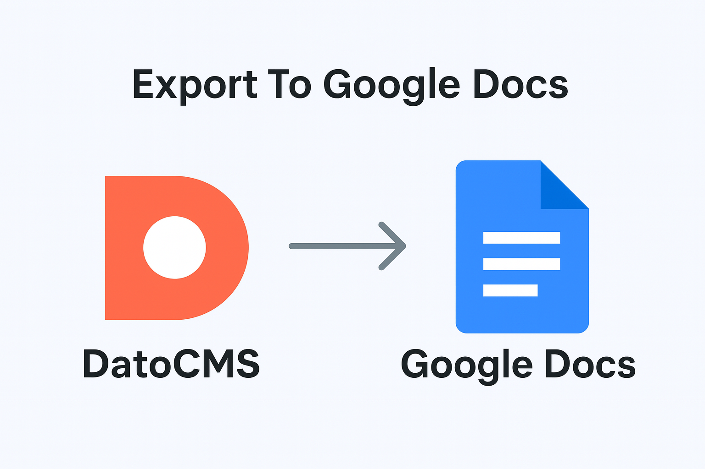

# DatoCMS Plugin: Export To Google Docs

A DatoCMS plugin that adds an "Export to Google Docs" button to the sidebar panel of records containing Structured Text fields. This plugin converts your structured content to a Google Docs-compatible format using markdown as an intermediary step, then creates a new Google Doc in your Google Drive.



## Features

- 🚀 **One-click export**: Export structured text content directly to Google Docs
- 📄 **Seamless conversion**: Converts DatoCMS Structured Text to Google Docs format
- 🔗 **Direct integration**: Opens the created Google Doc in a new browser tab
- ⚙️ **Easy configuration**: Simple setup through DatoCMS plugin settings
- 🎯 **Smart targeting**: Only appears on records with Structured Text fields at the root level

## Installation

### 1. Install the plugin in your DatoCMS project

You can install this plugin in your DatoCMS project in two ways:

**Option A: Via DatoCMS Plugin Store**

1. Go to your DatoCMS project settings
2. Navigate to the "Plugins" section
3. Search for "Export To Google Docs"
4. Click "Install" and follow the prompts

**Option B: Manual Installation**

1. Go to your DatoCMS project settings
2. Navigate to the "Plugins" section
3. Click "Add Plugin" and enter the URL where the plugin is hosted

### 2. Set up Google Cloud Platform credentials

To use this plugin, you need to create your own Google OAuth 2.0 Client ID. Here's how:

#### Create a Google Cloud Platform Project

1. Go to the [Google Cloud Console](https://console.cloud.google.com/)
2. Create a new project or select an existing one
3. Make sure billing is enabled for your project (required for API access)

#### Enable Required APIs

1. In the Google Cloud Console, navigate to **APIs & Services > Library**
2. Search for and enable the following APIs:
   - **Google Docs API**
   - **Google Drive API**

#### Set up OAuth 2.0 Credentials

1. Go to **APIs & Services > Credentials**
2. Click **Create Credentials > OAuth 2.0 Client ID**
3. If prompted, configure the OAuth consent screen:
   - Choose "External" user type
   - Fill in the required fields (app name, user support email, developer contact)
   - Add your domain to authorized domains if applicable
   - Add the following scopes:
     - `https://www.googleapis.com/auth/docs`
     - `https://www.googleapis.com/auth/drive.file`
4. For the OAuth 2.0 Client ID:
   - Choose "Web application" as the application type
   - Add `https://plugins.datocms.com` to **Authorized JavaScript origins** (this is where the plugin is hosted)
     - If developing locally, also add `http://localhost:5173` (or your local development server URL)
     - If you're hosting the plugin on a different domain, add that domain instead
   - Note: No redirect URIs are needed for this plugin
5. Copy the generated **Client ID** (you'll need this for plugin configuration)

## Configuration

1. In your DatoCMS project, go to **Configuration > Plugins**
2. Find the "Export To Google Docs" plugin and click on its settings
3. Enter your **Google OAuth 2.0 Client ID** in the configuration field
4. The settings will be saved automatically

## Usage

1. Navigate to any record that contains a Structured Text field at the root level
2. In the sidebar panel, you'll see an "Export to Google Docs" button
3. Click the button to start the export process
4. The first time you use it, you'll be prompted to authorize the plugin with your Google account
5. Once authorized, the plugin will:
   - Convert your structured text content to a Google Docs-compatible format
   - Create a new Google Doc in your Google Drive
   - Open the document in a new browser tab
6. The document will be named with the record's title (if available) plus the current date and time

## Requirements

- DatoCMS project with records containing Structured Text fields
- Google Cloud Platform account with billing enabled
- Google OAuth 2.0 Client ID configured in plugin settings

## Supported Content Types

The plugin works with any DatoCMS record that has:

- At least one Structured Text field at the root level of the model
- The field contains content to export

## Troubleshooting

### "Authentication failed" error

- Verify your Google OAuth 2.0 Client ID is correctly entered in the plugin settings
- Ensure the Google Docs and Google Drive APIs are enabled in your GCP project
- Check that your OAuth consent screen is properly configured

### Button doesn't appear

- Ensure the record has a Structured Text field at the root level
- Check that the plugin is properly installed and configured

### Export fails

- Verify your Google Cloud Platform project has billing enabled
- Ensure the required APIs (Google Docs and Drive) are enabled
- Check that the Authorized JavaScript origins are correctly configured

## Development

To develop this plugin locally:

```bash
# Clone the repository
git clone https://github.com/bitwise-invest/datocms-plugin-export-to-google-docs.git

# Install dependencies
npm install

# Start development server
npm run dev

# Build for production
npm run build
```

## Contributing

Contributions are welcome! Please feel free to submit a Pull Request.

## License

This project is licensed under the MIT License.

## Support

If you encounter any issues or have questions, please [open an issue](https://github.com/bitwise-invest/datocms-plugin-export-to-google-docs/issues) on GitHub.
